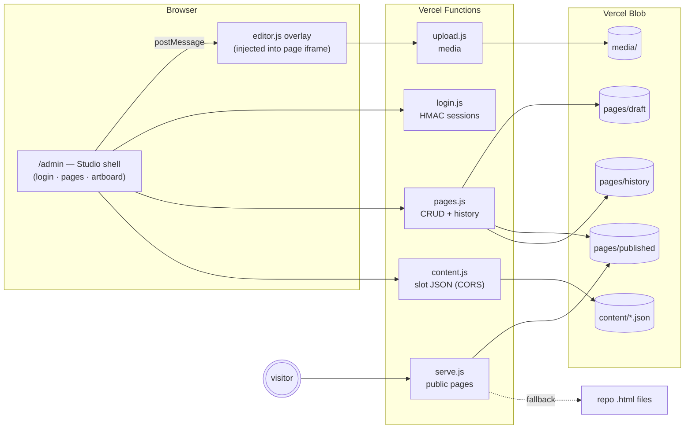
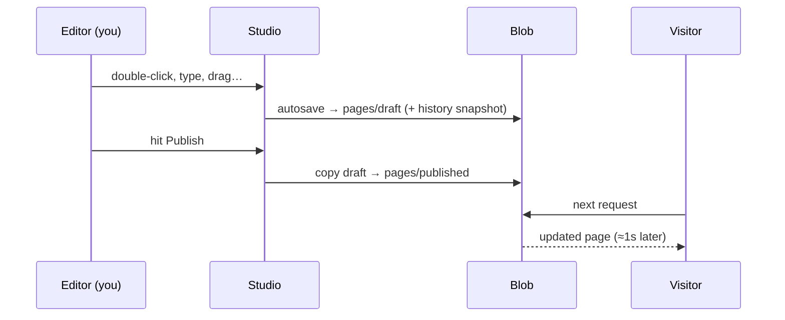

<div align="center">


# OpenSpace

### The visual editing layer for your own websites.

**Click. Edit. Publish. No rebuilds, no CMS lock-in, no monthly fee.**

A login-gated, Wix/Squarespace-class visual editor that overlays *your* site —
static HTML or Next.js — powered by five tiny serverless functions and Vercel Blob.


</div>

---

## ✦ What it feels like

```
┌────────────────────────────────────────────────────────────────────────┐
│  ⌘ OpenSpace   ⌂ index   ● Autosaved        🖥 📱   ↩ ↪   SEO  History │
├──────────┬─────────────────────────────────────────────┬───────────────┤
│ PAGES    │                                             │  IMAGE        │
│ ● index  │        ┌ Heading 1 ─────────────┐           │  ─ Source ─── │
│ ○ video  │        │ Telling Powerful       │           │  URL  [.....] │
│ ○ photo  │        │ Stories.               │           │  ⬆ Upload…    │
│ ○ book   │        └────────────────────────┘           │  ─ Adjust ─── │
│          │   ── ✛ Add section ──────────────────       │  brightness ▮ │
│ + New    │        [ hero image             ]           │  contrast   ▮ │
│          │        [ drag ⠿ to reorder      ]           │  ─ Animate ── │
│ ⌘K       │                                             │  fade-up  ▾   │
└──────────┴─────────────────────────────────────────────┴───────────────┘
```

Double-click any text and type. Click any image and swap it. Hover a section and
drag it somewhere else. Hit **Publish** — it's live in about a second.

---

## ✦ Features

| ✏️ Editing | 🎨 Design | 🚀 Workflow |
|---|---|---|
| In-place rich text (bold/italic/links) | Per-element style panel — fonts, colors, spacing | **Draft → Publish** — instant, no rebuild |
| Click-to-replace images & video | Color swatches + brand palette | **Autosave** every 3s of quiet |
| Drag-and-drop section reordering | Brightness / contrast / saturation sliders | **Version history** with one-click restore |
| Grid photos drag-swap | Corner radius & opacity | ⌘K **command palette** |
| 9 block templates w/ visual previews | Scroll-triggered **entrance animations** | Desktop / tablet / mobile preview |
| Squarespace-style “+ Add section” lines | Element badges & ancestor breadcrumbs | **Find & replace** across the page |
| Media library on Blob CDN | SEO title & description editor | Full keyboard map (press `?`) |

### Where it beats the incumbents

- **Version history with restore** — automatic snapshots on every save *and* publish
- **Instant publish** — Blob overrides serve in front of your repo files; zero build time
- **Your code stays yours** — pages are plain HTML in git; “Revert to original” erases every override
- **Portable** — one installer script drops it into any static or Next.js project
- **Free at this scale** — Vercel functions + Blob free tiers cover a portfolio site with room to spare

---

## ✦ Architecture



**The trick:** your site ships as static files in git. Publishing writes a Blob
override that `serve.js` delivers in front of the original. No database, no
build queue, no vendor format — delete the override and the original is back.



---

## ✦ Quick start

### 1 · Install

```bash
# static HTML site
./install.sh /path/to/site

# Next.js app
./install.sh /path/to/next-app --nextjs
```

### 2 · Configure Vercel (once, ~2 min)

| Setting | Where | Value |
|---|---|---|
| `EDITOR_PASSWORD` | Settings → Env Vars | your login password |
| `SESSION_SECRET` | Settings → Env Vars | `openssl rand -hex 32` |
| Blob store | Storage → Create → Blob → Connect | *(token auto-added)* |

Redeploy after setting them.

### 3 · Edit

Open **`/admin/`** → log in → click things. That's the manual.

---

## ✦ Next.js slots

Mark any region editable with the drop-in component:

```jsx
import OpenSlot from '@/components/OpenSlot';

<OpenSlot name="hero">
  <h1>Default headline</h1>
  <p>Renders until an edit is published.</p>
</OpenSlot>
```

Then in the Studio sidebar: **Edit a URL (slots)** → `/about` → the marked
regions light up green. Published slot content hydrates through a public,
CORS-open JSON endpoint — so one OpenSpace deployment can even feed content
to several sites.

---

## ✦ Repo map

```
openspace/
├── admin/index.html            the Studio (login, dashboard, artboard)
├── assets/editor.js            the overlay editor (~1k lines, zero deps)
├── api/
│   ├── _lib.js                 sessions (HMAC) + Blob helpers
│   ├── login.js                POST password → cookie
│   ├── pages.js                page CRUD · draft/publish · history
│   ├── serve.js                public server: override → repo fallback
│   ├── upload.js               media library (50MB, allowlisted types)
│   └── content.js              slot JSON for framework sites (CORS GET)
├── integrations/nextjs/OpenSlot.jsx
├── install.sh                  one-command install into any project
├── INTEGRATION.md              copy-paste integration steps
└── CLAUDE-BUILD-GUIDE.md       hand this repo to an AI — it can do the rest
```

## ✦ Security

- Single-editor auth: password → HMAC-SHA256-signed HttpOnly cookie (7-day expiry)
- Timing-safe comparisons on password and token checks
- Every mutating endpoint is session-gated; the only public surfaces are page
  serving and published slot JSON
- `/admin` is `noindex`; rename the folder for extra obscurity if you like

## ✦ License & lineage

Built from scratch as the editing layer for [bradyjordan.com](https://bradyjordan.com),
then extracted into this standalone system. Use it on your own sites freely.

<div align="center">

**OpenSpace** · *your site, editable.*

</div>
